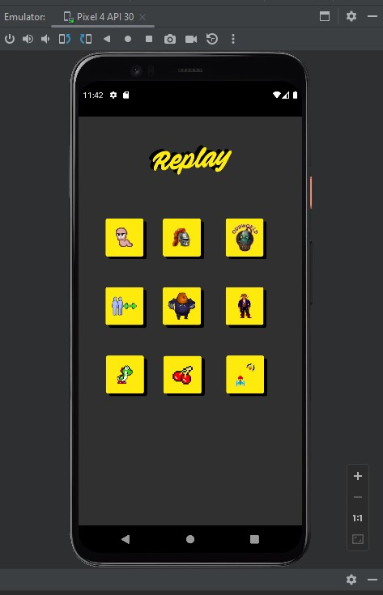

# Botonera Replay

Este es un TP para la materia Desarrollo de Sistemas en Dispositivos Móviles. Durante el primer cuatrimestre vimos Android Studio. La idea de este Trabajo Práctico es practicar algunas cuestiones que vimos durante la cursada.

El uso de la imagen de Replay, la mítica revista de videojuegos retro Argentina, fue debidamente solicitada para esta humilde app.

Por ahora el resultado es un work in progress. Voy a ir subiendo avances si la llego a cambiar o agregar algo.

