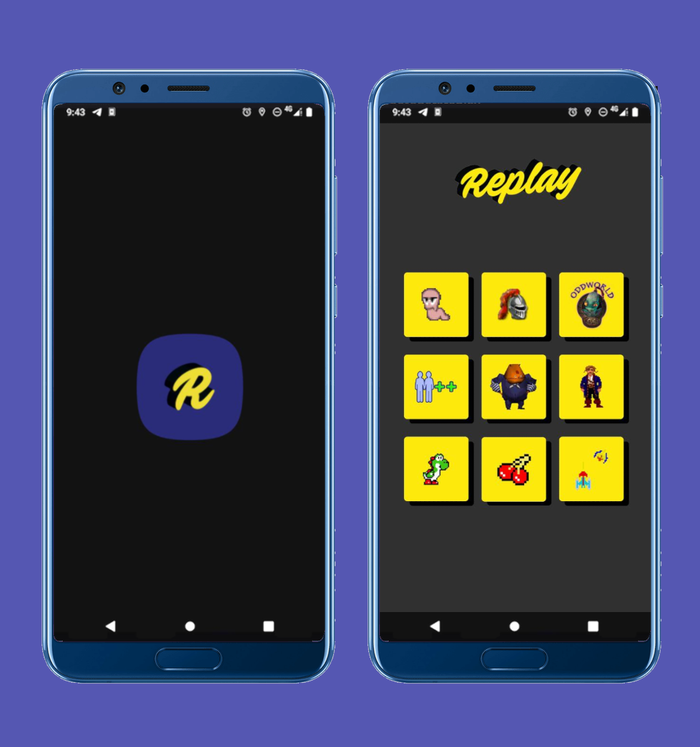

# Botonera Replay

Este es un TP para la materia Desarrollo de Sistemas en Dispositivos Móviles. Durante este primer cuatrimestre vimos Android Studio con Java. La idea de este TP es poner en práctica algunos elementos aprendidos durante la cursada, intentando hacer una app que solucione algún problema de la vida real.

En este caso pensé una app para un programa de radio, donde lxs conductores utilizan sonidos de videojuegos retro a través de una clásica "botonera". El diseño de la app lo hice en Figma y lo validé con el profe antes de empezar a maquetar. Los sonidos y las imágenes de los juegos los saqué de Internet.

El uso de la imagen de [Replay](https://revistareplay.com.ar/), la mítica revista de videojuegos retro Argentina, fue debidamente solicitada para esta humilde app.

Por ahora el resultado es un work in progress. Voy a ir subiendo avances si llego a cambiar o agregar algo por pedido de mis amigxs de Replay o por feedback del profe.